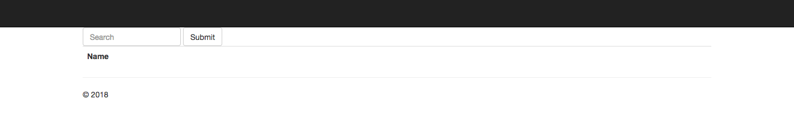
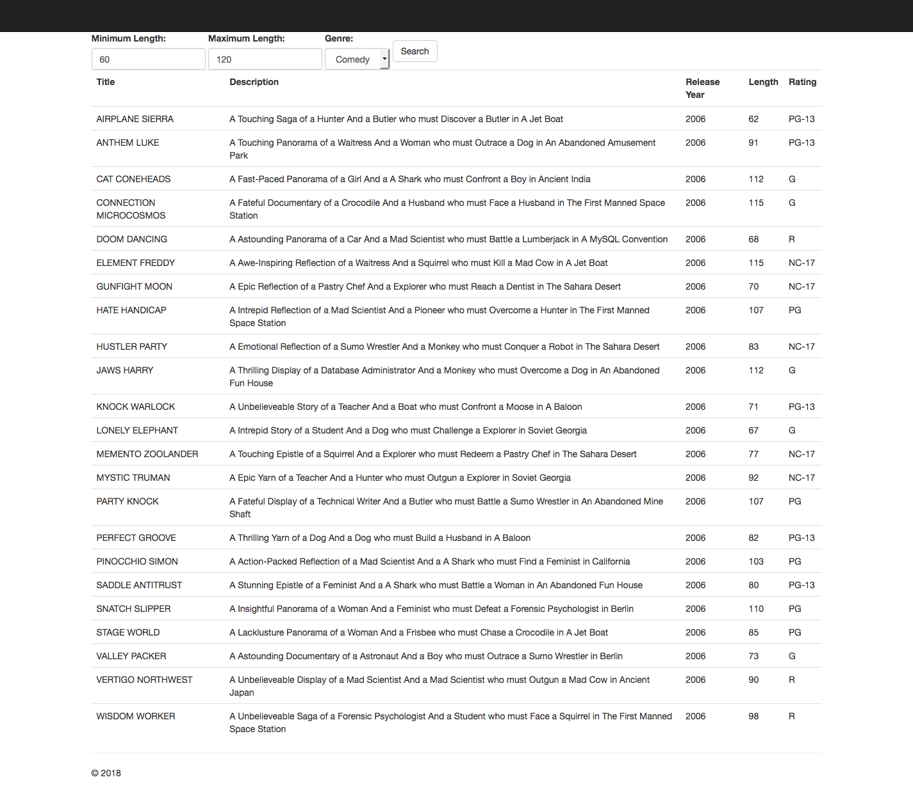
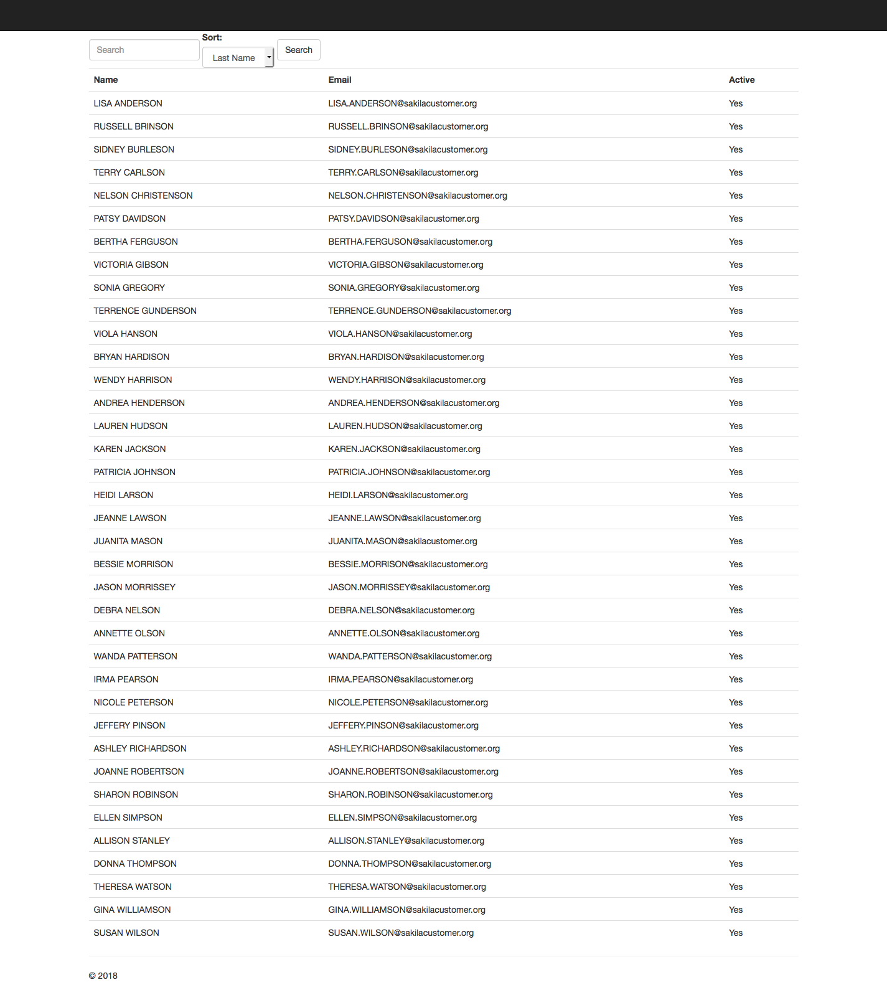

# Exercises

All exercises will be using the dvdstore database. DALs are already created, except for the Customer Search, where you will fill in the data access methods.

## Actor Search

Given a search string, display all the actors whose `last_name` contains that search string. Display should show `first_name` and `last_name`.

## Film Search

Given a minimum length, maximum length and genre, display a list of movies that match the search. Minimum and Maximum length could both be blank. Display should show `title`, `description`, `release_year`, `length` and `rating`.

## Customer Search

Take a name search and a sort order, display all customers whose `first_name` or `last_name` match the search, in the order specified. The sort order could be by `last_name`, `email`, or `active`. DALs will need to be made for this exercise.

