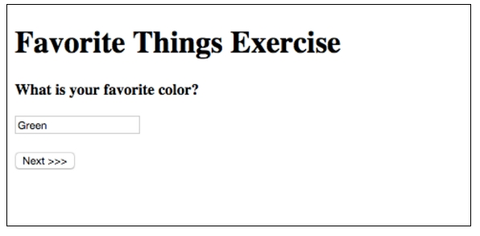
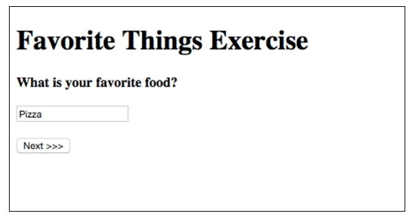
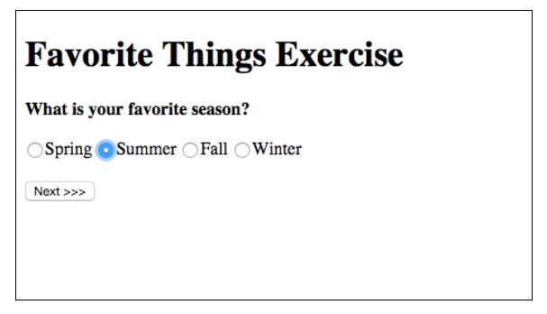
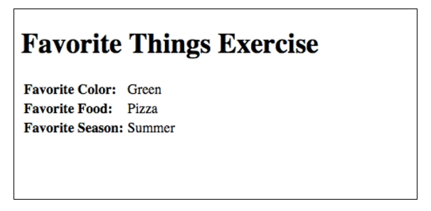

# Favorite Things Survey

In this exercise, your application should ask the user a series of questions and store each answer in the http session.  
After asking all questions, display a list of the user’s answers.

## Page 1

The user will see the first page on **FavoriteThings/Page1**

## Page 2

The user will see the second page on **FavoriteThings/Page2**

## Page 3

The user will see the third page on **FavoriteThings/Page3**

## Confirm

The user will see the last page on **FavoriteThings/Summary**

# Hints

* You'll need to create a FavoriteThings model that will hold the answers to all of the possible questions that the user will fill out.

* You'll need to use Session to store in progress status of the favorite things survey.
