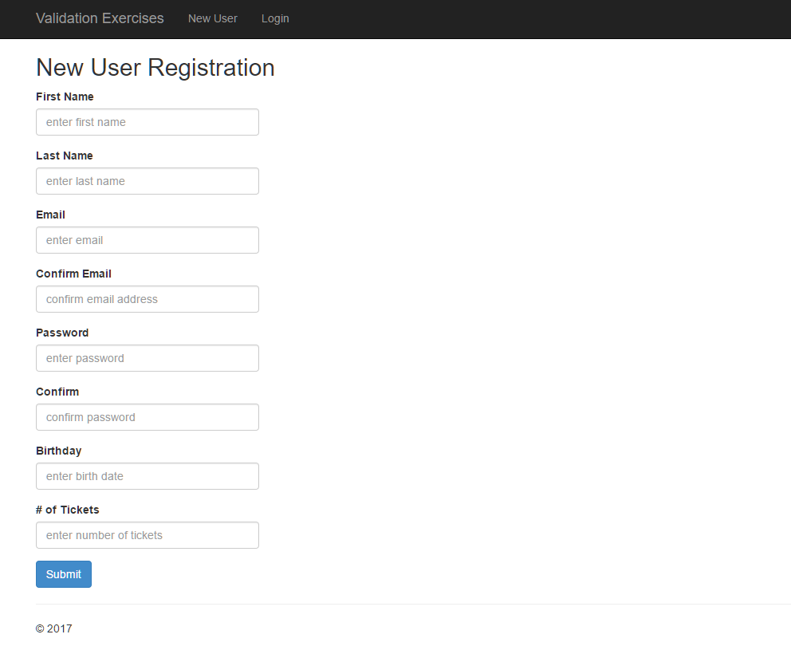
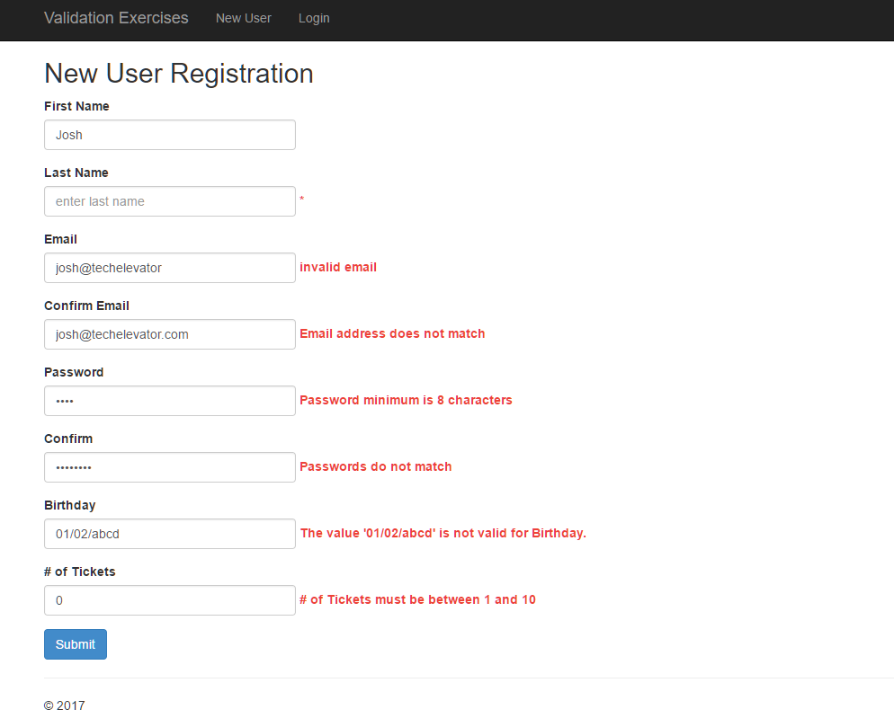

# Form Validation

## Login Form

Create a page that allows the user to _login_ to the site (it doesn't actually log them in). This page will ask the user for and validate the following information:

| Field | Rules |
|-------|-------|
| `Email` | Required, Valid Email Address |
| `Password` | Required |

### Login Validation Screen

### Login Success Screen

## Registration Form

Create a page that allows the user to _register_ to the site (it doesn't actually register them). This page will ask the user for and validate the following information:

| Field | Rules |
|-------|-------|
| `First Name` | Required, Max Length (20) |
| `Last Name` | Required, Max Length (20) |
| `Email` | Required, Valid Email Address | 
| `Confirm Email` | Must Match `Email` |
| `Password` | Required, Minimum Length (8) |
| `Confirm Password` | Must Match `Password` |
| `Birth Date` | Required, Valid Date |
| `Number of Tickets` | Required, Valid Range (1 to 10) |

### New Registration Page

### Registration Validation Screen

### Registration Success Screen

