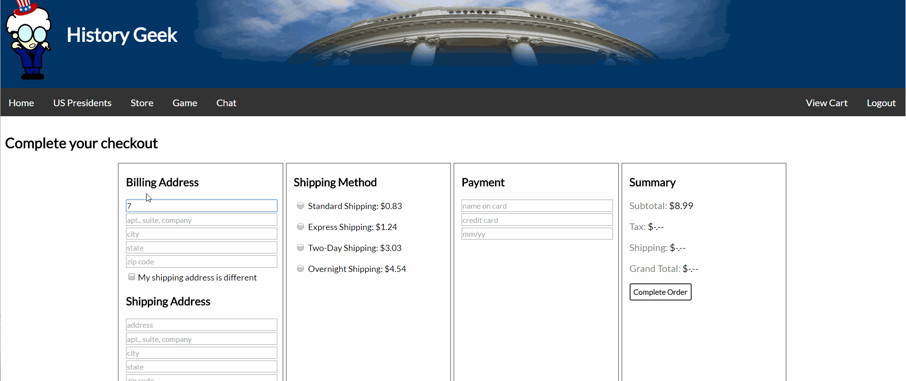
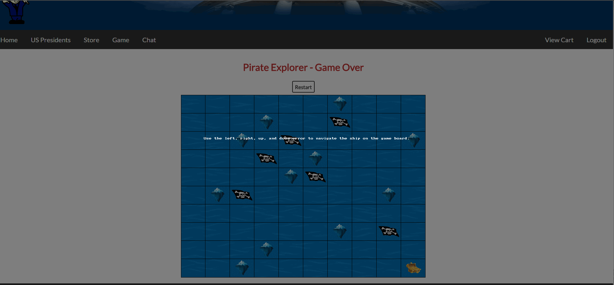
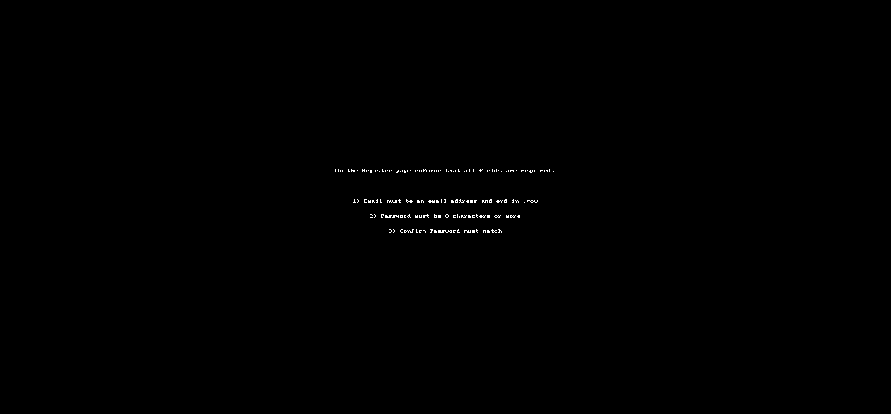
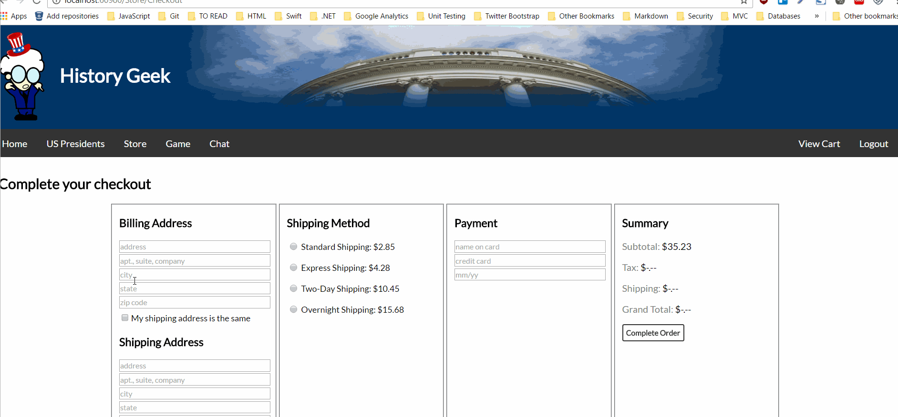
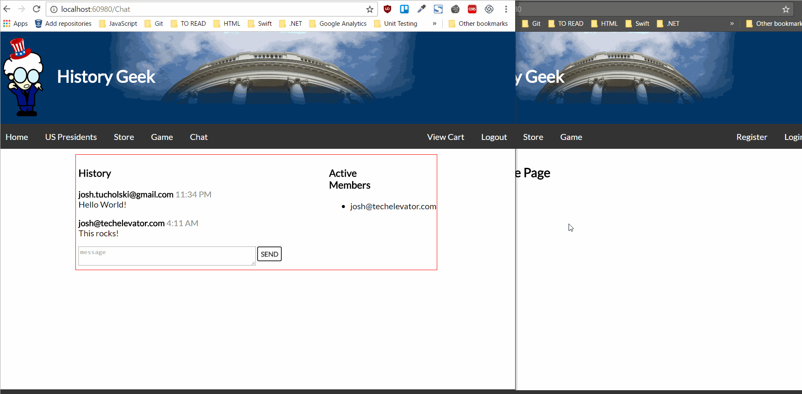

# History Geek

Welcome to the History Geek site!

## About History Geek

This application is a Spring MVC Application. It was built using the following libraries:

### jQuery

jQuery is a Javscript library used to simplify JavaScript commands interacting with the DOM (document object model). We have shorthand ways to:

- traverse the DOM and manipulate it
- bind events to DOM objects
- asynchronously invoke webservice methods using AJAX
- and more

[jQuery Github](https://github.com/jquery/jquery)

### jQuery.Validation

jQuery.Validation is a jQuery extension library. It helps with the trivial task of validating form elements (e.g. e-mail address, minimum/maximum length, password match, etc.)

[jQuery.Validation](https://github.com/jquery-validation/jquery-validation)

### Spring Websocket

Spring Framework's support for WebSocket-style messaging in web applications including use of STOMP as an application level WebSocket sub-protocol.

[Spring WebSocket](https://docs.spring.io/spring/docs/current/spring-framework-reference/html/websocket.html)

### STOMP Over WebSocket

STOMP is a simple text-oriented message protocol running on WebSocket. The library is a limited implemention of STOMP!!! You have been warned.

[STOMP](http://jmesnil.net/stomp-websocket/doc/)

### sockjs

SockJS is a JavaScript library that provides a WebSocket-like object that gives you a coherent, cross-browser, Javascript API which creates a communication channel between the browser and the web server.

[sockjs](https://github.com/sockjs/sockjs-client)

## Exercises

### Day 2 - DOM Manipulation

Using jQuery you'll be practicing DOM query and manipulation exercises. The US Presidents page has a series of instructions that you will need to complete. 
When you click on the **RUN** button for each exercise, it will call your code located in the `dom-exercises.js` file.

Below is an example of what it will look like if the exercise is implemented correctly.

### Day 3 - Event Handling

Update the Shopping Cart checkout feature.

1. When the *My Shipping Address is the same* is clicked, copy the contents of the Billing Address fields into the Shipping Address fields.
2. When the user selects a shipping method, copy the shipping price into the Order Summary section and update the Grand Total

Make the Game more interactive by supporting various events to respond to user interaction.

1. Bind to the keydown event and listen for left, right, up and down keys to move the ship.
2. Bind the restart button to a click to reset the status of the game board.

### Day 4 - Validation

Add in Client-Side Validation to the following pages on the site:

1. Registration form
2. Login form
3. Order Checkout form

### Day 6 - AJAX Exercise

Call the /api/getTax service to calculate the tax for the order. The inputs to the service are:

1. billingZipCode
2. subtotal

The output of the service is the calculated tax amount for the order.

### Day 7 - Real Time Application w/Javascript

Using the websockets library update the Chat page with the following.

1. Submitting a chat message and use AJAX to POST the data to /chat/index so that the page doesn't reload when a message is sent.
2. Connect with websockets and listen for *received* broadcast messages. Update the UI accordingly. 
    1. Your client will receive a broadcast when a new member joins or leaves. Refresh the active members list when this is received.
    2. Your client will receive a broadcast when someone sends a message. Add the message to the chat window then this is received. 

